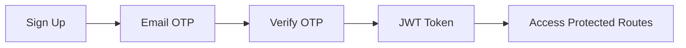

# SafeWalk Campus API

[](LICENSE)
[](https://nodejs.org/)
[](https://mongodb.com/)
[](https://expressjs.com/)
[](https://jestjs.io/)
[](https://swagger.io/)

---

## 🎯 Project Overview

**SafeWalk Campus** is a responsive campus safety web application that enables students to instantly notify trusted contacts and university security during emergencies while sharing their live location.

Built as a **mobile-first** application, it delivers both mobile and desktop experiences — every primary screen and user flow includes responsive desktop layouts. The MVP is deliberately narrow — a **fast, reliable alert mechanism**, not a full emergency response platform — built to work even on weak network connections for non-technical or low-literacy users.

**Built for:** Orange Internship Programme · Synapse Circle · Demo Day

---

## 📋 Project Brief

### Problem Statement

Students walking on or around campus may encounter situations where they feel unsafe but have no fast, reliable way to alert trusted contacts or campus security with their live location. Existing communication methods often require multiple steps, which can delay emergency response during critical situations.

### Target Users

| Type             | Description                                                                     |
| ---------------- | ------------------------------------------------------------------------------- |
| **Primary**      | Students living on or near campus who need fast emergency access                |
| **Secondary**    | Campus security desks who receive alert notifications with live location        |
| **Stakeholders** | A small circle of 2–3 trusted contacts designated by the user to receive alerts |

### Project Goals

#### User Goals

- Alert trusted contacts instantly
- Access emergency numbers quickly
- Cancel false alarms easily
- Stay logged in without friction

#### Product Goals

- One-tap SOS in under 5 seconds
- Reliable email delivery
- Works on weak mobile data
- Simple onboarding under 2 minutes

#### Business Goals

- Demonstrate a working MVP at Demo Day
- Validate the alert-and-confirm core loop
- Deliver a focused, shippable product within 6 weeks

### Success Metrics

| Metric                     | Target                        |
| -------------------------- | ----------------------------- |
| Onboarding completion time | Under 2 minutes               |
| SOS dispatch time          | Within 5 seconds              |
| Alert delivery rate        | 95% during testing            |
| False alarm cancellation   | Success within defined window |
| Email verification (OTP)   | 100% during usability testing |

---

## ✅ Confirmed Features

| Feature                           | Status | Description                                                                 |
| --------------------------------- | ------ | --------------------------------------------------------------------------- |
| **One-Tap SOS**                   | ✅     | Sends current GPS location to emergency contacts and university security    |
| **Emergency Contacts**            | ✅     | Add and manage trusted emergency contacts (max 3)                           |
| **Nearby Hospital Directory**     | ✅     | Pre-loaded directory of nearby hospitals                                    |
| **Alert Confirmation**            | ✅     | Shows alert was sent with confirmation details                              |
| **Alert History**                 | ✅     | Personal incident log with timestamp and status                             |
| **Live Location Sharing**         | ✅     | Shares real-time location with alert recipients                             |
| **False Alarm**                   | ✅     | Sends follow-up notification to disregard previous alert                    |
| **Location Permission**           | 🚧     | Request and manage location access (frontend implementation)                |
| **Responsive Desktop Experience** | 🚧     | Every primary screen includes responsive desktop layouts (frontend)         |
| **University Selection**          | 🚧     | Select university during onboarding to associate security contact (planned) |

### Explicitly Out of Scope

- ❌ Real-time tracking / route monitoring (SafeWalk mode)
- ❌ Integration with police or official dispatch systems
- ❌ In-app audio or video recording
- ❌ Group or community alert features
- ❌ Multi-language support

---

## 🚀 Core Features

### Authentication Flow



- **Email-based OTP verification** (no password required)
- **JWT authentication** with 7-day expiry
- **Session persistence** for frictionless re-entry

### Onboarding Flow

```
Landing → Location Permission → Select University → Add Contacts → Setup Complete → Home
```

The selected university automatically associates the appropriate university security contact, ensuring SOS alerts are routed to the correct campus security team without additional user configuration.

### SOS Behaviour

One tap immediately sends an alert to:

- Emergency Contact 1
- Emergency Contact 2
- University Security Officer

The alert includes the user's live location. A 30-second countdown begins after the alert is dispatched.

### False Alarm

Pressing **False Alarm** sends a follow-up notification to the same recipients informing them that the previous emergency alert should be disregarded. This ensures accidental triggers do not cause unnecessary panic.

### Alert Message

The emergency alert uses a fixed, predefined message:

> **"Help me, I am in an unsafe environment and I feel unsafe, here's my live location."**

This message cannot be edited by the user. It communicates urgency clearly and consistently to all recipients.

---

## 🛠️ Technology Stack

| Layer                 | Technology                |
| --------------------- | ------------------------- |
| **Runtime**           | Node.js 18+               |
| **Framework**         | Express.js 4.18+          |
| **Database**          | MongoDB 6+ (Mongoose ODM) |
| **Authentication**    | JWT + Email OTP           |
| **Email Service**     | Brevo (SendinBlue) API    |
| **API Documentation** | Swagger/OpenAPI 3.0       |
| **Testing**           | Jest + Supertest          |
| **Logging**           | Winston                   |
| **Rate Limiting**     | express-rate-limit        |
| **Validation**        | express-validator         |

---

## 📁 Project Structure

```
src/
├── models/
│   ├── User.js               # User profile & authentication
│   ├── OTP.js                # One-time password management
│   ├── TrustedContact.js     # Emergency contacts (max 3)
│   ├── SOSAlert.js           # SOS alert records
│   ├── AlertRecipient.js     # Alert delivery tracking
│   ├── CampusSecurity.js     # University security contacts
│   └── EmergencyDirectory.js # Hospitals, police, fire, etc.
├── routes/
│   ├── auth.js               # Authentication endpoints
│   ├── contacts.js           # Contact management
│   ├── sos.js                # SOS alert endpoints
│   └── emergency.js          # Emergency directory endpoints
├── services/
│   ├── emailService.js       # Brevo email integration
│   └── sosService.js         # Alert orchestration logic
├── middlewares/
│   ├── auth.js               # JWT verification
│   ├── validator.js          # Request validation
│   ├── errorHandler.js       # Global error handling
│   └── rateLimiter.js        # Rate limiting
├── utils/
│   ├── logger.js             # Winston logging
│   ├── constants.js          # Application constants
│   └── validators.js         # Validation utilities
├── tests/
│   ├── auth.test.js          # Authentication tests
│   ├── contacts.test.js      # Contact management tests
│   ├── sos.test.js           # SOS alert tests
│   ├── emergency.test.js     # Emergency directory tests
│   ├── health.test.js        # Health check tests
│   └── helpers/
│       ├── authHelper.js     # Test authentication helper
│       └── emailService.mock.js # Mock email service
└── swagger.js                # OpenAPI documentation
```

---

## 🚦 API Endpoints

### Health Check

| Method | Endpoint  | Description       |
| ------ | --------- | ----------------- |
| GET    | `/health` | API health status |

### Authentication

| Method | Endpoint               | Description          | Rate Limit |
| ------ | ---------------------- | -------------------- | ---------- |
| POST   | `/api/auth/signup`     | Send OTP to email    | 5/15min    |
| POST   | `/api/auth/verify-otp` | Verify OTP & get JWT | 5/15min    |
| POST   | `/api/auth/resend-otp` | Resend OTP           | 3/15min    |
| POST   | `/api/auth/logout`     | Logout (client-side) | -          |
| GET    | `/api/auth/me`         | Get user profile     | -          |

### Contacts

| Method | Endpoint                        | Description              | Rate Limit |
| ------ | ------------------------------- | ------------------------ | ---------- |
| GET    | `/api/contacts`                 | Get all trusted contacts | -          |
| POST   | `/api/contacts`                 | Add trusted contact      | 20/hour    |
| PUT    | `/api/contacts/:id`             | Update contact           | -          |
| DELETE | `/api/contacts/:id`             | Delete contact           | -          |
| GET    | `/api/contacts/campus-security` | Get security contacts    | -          |

### SOS Alerts

| Method | Endpoint               | Description             | Rate Limit |
| ------ | ---------------------- | ----------------------- | ---------- |
| POST   | `/api/sos/trigger`     | Trigger emergency alert | 3/5min     |
| POST   | `/api/sos/cancel/:id`  | Cancel false alarm      | -          |
| GET    | `/api/sos/history`     | Get alert history       | -          |
| GET    | `/api/sos/history/:id` | Get specific alert      | -          |
| GET    | `/api/sos/status/:id`  | Check alert status      | -          |

### Emergency Directory

| Method | Endpoint                       | Description                |
| ------ | ------------------------------ | -------------------------- |
| GET    | `/api/emergency/directory`     | Get all emergency contacts |
| GET    | `/api/emergency/directory/:id` | Get specific contact       |
| GET    | `/api/emergency/nearby`        | Get nearby contacts        |

---

## 🔐 Security Features

### Authentication

- **JWT Authentication** with 7-day expiry
- **OTP Verification** via email (10-minute expiry)
- **Passwordless** signup/login flow

### Rate Limiting

| Limiter     | Window     | Max Requests |
| ----------- | ---------- | ------------ |
| Auth        | 15 minutes | 5            |
| OTP         | 15 minutes | 3            |
| SOS         | 5 minutes  | 3            |
| Contacts    | 1 hour     | 20           |
| General API | 15 minutes | 100          |

### Data Protection

- **Input Validation** with express-validator
- **MongoDB Injection Protection** via Mongoose
- **Helmet.js** security headers
- **CORS** configured for allowed origins

---

## 🚦 SOS Alert Flow

```
┌─────────────────────────────────────────────────────────────────┐
│                        1. User Triggers SOS                    │
│                  One-tap on the panic button                   │
└─────────────────────────────┬───────────────────────────────────┘
                              │
                              ▼
┌─────────────────────────────────────────────────────────────────┐
│                   2. Location Capture                          │
│              GPS coordinates (if available)                    │
│              Fallback: "Location unavailable"                  │
└─────────────────────────────┬───────────────────────────────────┘
                              │
                              ▼
┌─────────────────────────────────────────────────────────────────┐
│                   3. Create Alert Record                       │
│              Status: "sent"                                    │
│              Timestamp recorded                                │
└─────────────────────────────┬───────────────────────────────────┘
                              │
                              ▼
┌─────────────────────────────────────────────────────────────────┐
│                   4. Identify Recipients                       │
│         • Trusted Contacts (max 3)                            │
│         • Campus Security                                     │
└─────────────────────────────┬───────────────────────────────────┘
                              │
                              ▼
┌─────────────────────────────────────────────────────────────────┐
│                   5. Send Email Alerts                         │
│         • Live location link (Google Maps)                    │
│         • Emergency message with user details                 │
│         • Cancellation instructions                           │
└─────────────────────────────┬───────────────────────────────────┘
                              │
                              ▼
┌─────────────────────────────────────────────────────────────────┐
│                   6. Delivery Tracking                         │
│         • Track which recipients received alerts              │
│         • Log delivery status (sent/delivered/failed)         │
└─────────────────────────────┬───────────────────────────────────┘
                              │
                              ▼
┌─────────────────────────────────────────────────────────────────┐
│                   7. User Confirmation                         │
│         • Alert sent successfully                             │
│         • Number of recipients notified                       │
│         • Cancellation window (5 minutes)                     │
└─────────────────────────────────────────────────────────────────┘
```

---

## 🧪 Testing

### Run Tests

```bash
# Run all tests
npm test

# Run specific test suite
npm test -- auth.test.js
npm test -- contacts.test.js
npm test -- sos.test.js
npm test -- emergency.test.js
npm test -- health.test.js

# Run tests with coverage
npm test -- --coverage

# Run tests in watch mode
npm test -- --watch
```

### Test Coverage

| Suite               | Tests                                     | Status |
| ------------------- | ----------------------------------------- | ------ |
| Authentication      | Signup, OTP verification, JWT, Resend OTP | ✅     |
| Contacts            | CRUD operations, max contacts limit       | ✅     |
| SOS Alerts          | Trigger, cancel, history, status          | ✅     |
| Emergency Directory | Search, filter, nearby contacts           | ✅     |
| Health Check        | API status, MongoDB connection            | ✅     |

### Test Helpers

```javascript
import { getAuthToken, clearAuthCache } from "./helpers/authHelper.js";

// Get authenticated token for testing
const { token, userId } = await getAuthToken({
  email: "test@campus.edu",
  phoneNumber: "+1234567890",
  name: "Test User",
});

// Clear authentication cache
clearAuthCache();
```

---

## 📦 Installation

### Prerequisites

- Node.js 18+
- MongoDB 6+
- Brevo API Key (for email)

### Environment Variables

Create `.env` file in the root directory:

```env
# Server
PORT=5000
NODE_ENV=development

# Database
MONGODB_URI=mongodb://localhost:27017/safewalk

# JWT
JWT_SECRET=your-super-secret-jwt-key
JWT_EXPIRE=7d

# Email (Brevo)
BREVO_API_KEY=your-brevo-api-key
BREVO_FROM_EMAIL=noreply@safewalk-campus.com
BREVO_FROM_NAME=SafeWalk Campus

# Configuration
MAX_TRUSTED_CONTACTS=3
CANCELLATION_WINDOW_MINUTES=5
SOS_TIMEOUT_SECONDS=5
OTP_EXPIRY_MINUTES=10

# Logging
LOG_LEVEL=info

# Test Environment (.env.test)
MONGODB_URI=mongodb://localhost:27017/safewalk_test
DISABLE_EMAIL_SENDING=true
DISABLE_RATE_LIMITING=true
```

### Setup

```bash
# Clone repository
git clone https://github.com/yourusername/synap-circle.git
cd synap-circle

# Install dependencies
npm install

# Start MongoDB locally (using Docker)
docker run -d -p 27017:27017 --name mongodb mongo:6

# Run in development mode
npm run dev

# Run in production mode
npm start

# Run tests
npm test

# Generate Swagger documentation
npm run swagger
```

---

## 📚 API Documentation

Interactive Swagger documentation is available at:

| Environment           | URL                                        |
| --------------------- | ------------------------------------------ |
| **Local Development** | http://localhost:5000/api-docs             |
| **Production**        | https://synap-circle.onrender.com/api-docs |

The API documentation includes:

- All endpoints with request/response schemas
- Authentication requirements
- Example requests and responses
- Try-it-out functionality

---

## 📊 Data Models

### User

```javascript
{
  phoneNumber: String,      // +1234567890
  email: String,            // student@campus.edu
  name: String,             // John Doe
  isVerified: Boolean,      // OTP verification status
  isActive: Boolean,        // Account active status
  lastLogin: Date,          // Last login timestamp
  preferences: {
    autoShareLocation: Boolean,   // Default: true
    alertSound: Boolean           // Default: true
  }
}
```

### TrustedContact (max 3 per user)

```javascript
{
  userId: ObjectId,         // Reference to User
  name: String,             // Jane Smith
  phoneNumber: String,      // +1234567891
  email: String,            // jane@example.com
  relationship: String,     // parent | sibling | friend | roommate | partner | other
  isPrimary: Boolean,       // Primary contact flag
  isActive: Boolean         // Soft delete
}
```

### SOSAlert

```javascript
{
  userId: ObjectId,         // Reference to User
  latitude: Number,         // GPS latitude
  longitude: Number,        // GPS longitude
  locationAvailable: Boolean, // Whether location was captured
  locationLink: String,     // Google Maps URL
  status: String,           // sent | cancelled | failed | resolved
  cancelledAt: Date,        // Cancellation timestamp
  cancellationReason: String, // false_alarm | resolved | user_error
  contactsNotified: [{
    type: String,           // trusted_contact | campus_security
    name: String,
    email: String,
    phoneNumber: String,
    delivered: Boolean,
    deliveredAt: Date,
    error: String
  }],
  recipients: [{
    type: String,
    recipientId: ObjectId,
    email: String,
    phoneNumber: String,
    name: String
  }]
}
```

### CampusSecurity

```javascript
{
  name: String,             // Campus Security Main Desk
  phoneNumber: String,      // +1234567890
  email: String,            // security@campus.edu
  location: String,         // Main Building, Ground Floor
  coordinates: {
    latitude: Number,
    longitude: Number
  },
  isActive: Boolean,        // Active status
  isPrimary: Boolean,       // Primary contact flag
  description: String,
  operatingHours: String    // 24/7
}
```

### EmergencyDirectory

```javascript
{
  type: String,             // security | hospital | police | ambulance | fire
  name: String,             // University Health Center
  phoneNumber: String,      // +1234567893
  address: String,          // Health Center Building, Campus
  coordinates: {
    latitude: Number,
    longitude: Number
  },
  isVerified: Boolean,      // Verified by admin
  isActive: Boolean,        // Active status
  description: String,      // Campus Health Services
  operatingHours: String    // 8:00 AM - 8:00 PM
}
```

---

## 🎨 Design Considerations

### Speed over Complexity

Every second matters in an emergency. UI decisions prioritize time-to-SOS above all else.

### One-Tap Emergency Access

The SOS button must be reachable in 1–2 taps from any screen the user is likely to be on.

### Large Touch Targets

All primary actions use minimum 48×48px touch targets to reduce misfire risk under stress.

### Low-Literacy Accessible

Minimal text, clear icons, and consistent visual language for non-technical or low-literacy users.

### Clear System Feedback

Every action — alert sent, GPS unavailable, SMS failed — must show explicit, readable feedback. No silent failures.

### Minimal Cognitive Load

Remove choices. The user is in distress. Reduce decisions to the absolute minimum at every step.

### Reliability and Trust

The app must work on intermittent mobile data. If it fails, the user must know immediately.

---

## 📈 Deliverables

- ✅ Mobile Wireframes
- ✅ Desktop Wireframes
- ✅ Mobile High-Fidelity Designs
- ✅ Desktop High-Fidelity Designs
- ✅ Responsive Component Library
- ✅ Responsive Prototype
- ✅ Design System

---

## 🤝 Contributing

1. Fork the repository
2. Create a feature branch (`git checkout -b feature/amazing-feature`)
3. Commit your changes (`git commit -m 'Add amazing feature'`)
4. Push to the branch (`git push origin feature/amazing-feature`)
5. Open a Pull Request

### Pull Request Guidelines

- Write clear, descriptive commit messages
- Include tests for new features
- Update documentation as needed
- Follow the existing code style

---

## 📄 License

This project is licensed under the MIT License - see the [LICENSE](LICENSE) file for details.

---

## 👥 Team

**Synapse Circle** · Orange Internship Programme

| Role               | Name               |
| ------------------ | ------------------ |
| Product Owner      | [CIRCLE]           |
| Product Manager    | [Precious]         |
| Frontend Developer | [Name]             |
| Backend Developer  | [Thanks Agbeble]   |
| Designer           | [Blessing]         |
| Data Analyst       | [Nyikwagh Ephraim] |

## 📝 Changelog

### v1.0.0 (July 2026)

- Initial MVP release
- One-tap SOS with location sharing
- Trusted contacts management (max 3)
- Email OTP authentication
- Alert history tracking
- Emergency directory
- False alarm cancellation
- Comprehensive test suite

---

**Built with ❤️ for campus safety** · SafeWalk Campus · Synapse Circle · Orange Internship Programme

---

> _"SafeWalk Campus - One-tap Panic Button Application API. A platform that lets students and campus residents alert their trusted contacts and campus security with their live location the moment they feel unsafe."_
